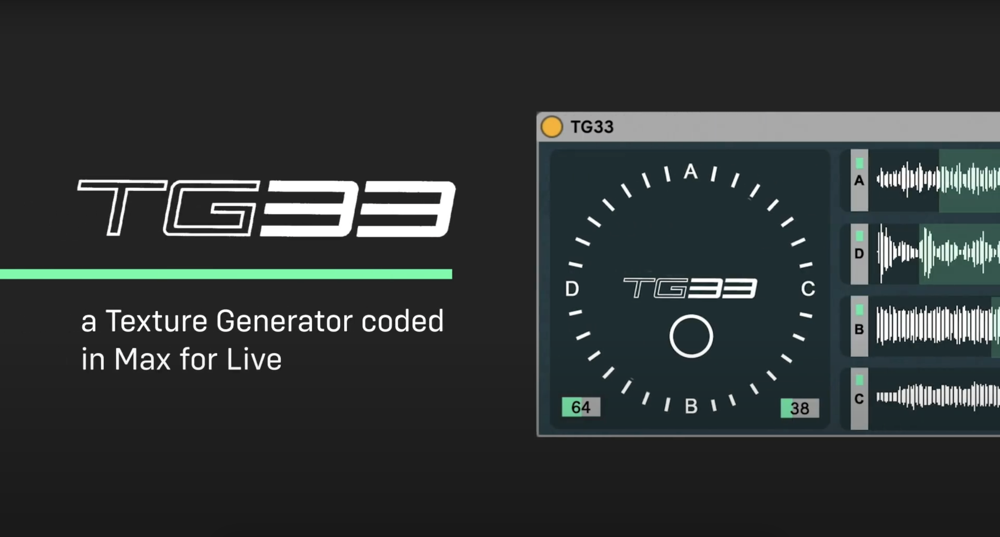

# TG33 - Texture Generator 
## a sample based texture synthesizer coded in Max for Live.  

## Where to start?
This repository consists of the source code for this Max for Live device (audio plugin).  
In order to use the **TG33 Texture Generator** you need a [Max for Live](https://www.ableton.com/de/live/max-for-live/) licence and [Live](https://www.ableton.com/de/live/).

*"You're about to enter an exciting new world of vector synthesis combining sample playback and tone generation. Vector synthesis allows you to create and control synthesized sound with unprecedented ease - in a very intimate, "human" way, putting you more closely in touch with your music. [...] The more you use the TG33, the more [...] it will become an indispensable part of your musical repertoire."*  *(Yamaha TG33 Manual)*  

## Video

To see what this audio plugin does have a look over [here](https://youtu.be/KOfle89aNhE).

## Using TG33 with Live

### This is how to get going:
1. Download 
2. Unpack
3. Copy the whole folder to any directory visible for Live.
4. From within Live: drag *TG33.amxd* file on Audio/MIDI track.
5. Explore and create new interesting soundscapes!
